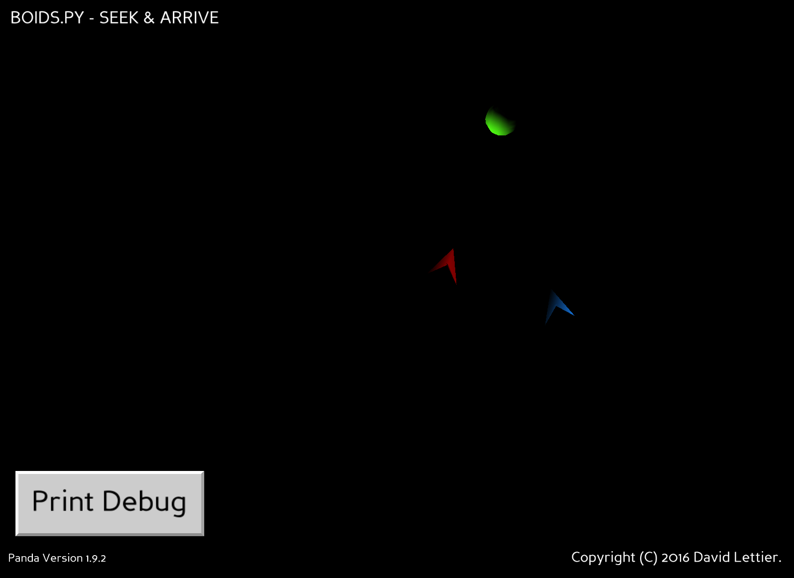

## Autonomous Steering Behaviors: Seek & Arrive

A boids clone done in 3D using the Panda3D game engine.
You move the green ball with your mouse while the blue boid arrives at the ball and the red boid seeks out the ball.

To use, you will need Panda3D SDK version 1.9.2.

Special thanks to Daniel Shiffman (http://www.shiffman.net/).

_(C) 2016 David Lettier._  
http://www.lettier.com/ 
